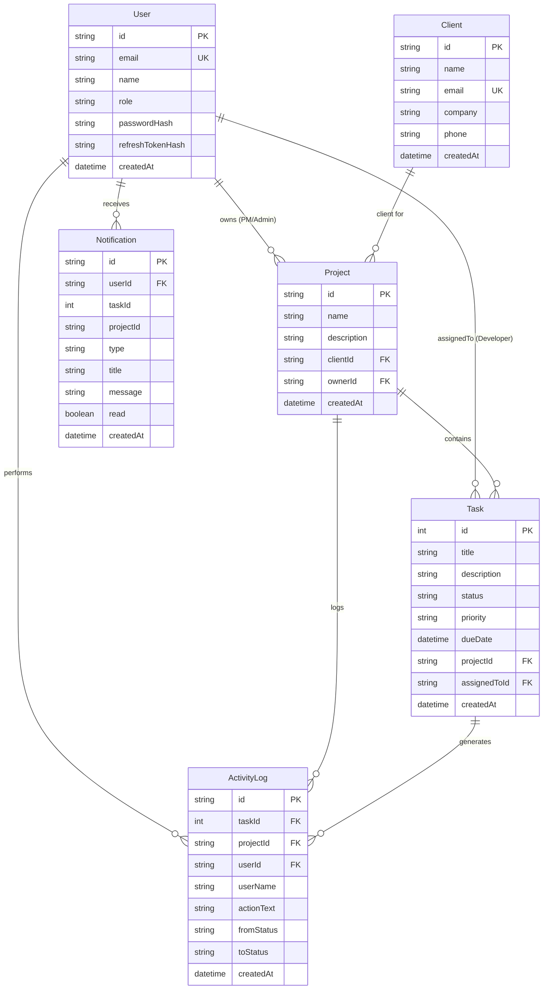

# Velozity — Real-Time Client Project Dashboard

A production-grade, full-stack client project management dashboard featuring strict API-level Role-Based Access Control (RBAC), live WebSocket activity streams, presence tracking, automated background cron scheduling, and shareable URL-filtered states.

Built for the **Velozity Global Solutions** Technical Hiring Assessment.

🌐 **Live Production Deployment**: [https://velozity-dashboard.onrender.com](https://velozity-dashboard.onrender.com)  
*(Includes 1-click test logins on the login page for Admin, Project Managers, and Developers)*

---

## 1. Architectural Decisions & Rationale

### 1.1 WebSocket Library: Socket.io vs Native WebSocket
**Choice: Socket.io**
- **Room Multiplexing**: Seamlessly isolates real-time event distribution into rooms (`project:${projectId}`, `user:${userId}`, and `role:ADMIN`) without having to manually build custom subscription routing layers.
- **Connection Resilience**: Built-in exponential backoff reconnection and connection state recovery ensure developers reconnect cleanly after network hiccups.
- **Heartbeat & Handshake Auth**: First-class support for authentication middleware during handshake (`io.use`) verifying JWT access tokens before opening socket channels.

### 1.2 Job Queue Choice: node-cron vs Bull Queue
**Choice: node-cron**
- **Zero Heavy Infrastructure Footprint**: `node-cron` delivers accurate periodic evaluation (`* * * * *`) directly in-process without requiring a dedicated Redis cluster dependency for a standalone deployment.
- **Atomic Database Evaluation**: The overdue scanner executes atomic SQL queries (`WHERE dueDate < NOW() AND status NOT IN ('DONE', 'OVERDUE')`) within database transactions, creating corresponding immutable `ActivityLog` records and alerting assigned developers and project managers in real time.
- *Scale-out note*: In a horizontally scaled multi-pod deployment, we would transition to BullMQ with Redis and transactional outbox patterns.

### 1.3 Token Storage & Authentication Strategy
- **Access Token**: Short-lived (15 minutes) signed JWT stored in application memory, attached via `Authorization: Bearer <token>` on API and WebSocket requests.
- **Refresh Token**: Long-lived (7 days) signed JWT stored strictly in an **`HttpOnly`, `SameSite=Lax` (or `Strict` in production), `Secure` cookie** partitioned under `/api/auth`. This prevents token exfiltration through XSS attacks.
- **Token Rotation & Replay Protection**: Refresh tokens are hashed using `bcrypt` and persisted in the database. When `/api/auth/refresh` is called, the old token is invalidated and a fresh pair is issued. If a revoked refresh token is replayed, the user session is immediately terminated.

---

## 2. Database Schema & Indexing Strategy



### Strategic PostgreSQL Indexes:
1. `Task(projectId, status)`: Accelerates dashboard queries filtering tasks within a project by status.
2. `Task(assignedToId, status)`: Essential for Developer dashboard loading only assigned tasks.
3. `Task(dueDate, status)`: Heavily leveraged by the background `node-cron` scanner to identify overdue tasks without triggering full sequential table scans.
4. `ActivityLog(projectId, createdAt DESC)`: Enables high-performance descending activity feed queries and cursor-based pagination for project streams.
5. `ActivityLog(createdAt DESC)`: Powers the global Admin activity feed and missed-event database catchup.
6. `Notification(userId, read)`: High-frequency index serving the real-time unread notification count badge in the navigation header.

---

## 3. Strict API-Level RBAC Enforcement

Role-based access is strictly enforced in Express middleware and service queries, never relying on UI hiding:
- **Admin (`ADMIN`)**:
  - Full visibility across all clients, projects, users, tasks, and system logs.
  - Can create and reassign projects and tasks.
- **Project Manager (`PROJECT_MANAGER`)**:
  - Can create projects and assign tasks to developers.
  - **Ownership Barrier**: PMs can *only* view, edit, or delete projects they personally created (`where: { ownerId: user.id }`). Attempting to fetch or mutate another PM's project ID yields `403 Forbidden`.
- **Developer (`DEVELOPER`)**:
  - **Assignment Boundary**: Developers can *only* query tasks assigned to their user ID (`where: { assignedToId: user.id }`).
  - **Status Updates Only**: Developers can mutate the `status` of their assigned tasks via `PATCH /api/tasks/:id/status`. Attempting to modify task metadata (title, due date, assignee) or updating another developer's task immediately triggers `403 Forbidden`.

---

## 4. Local Setup & Running Instructions

### Option A: Docker Compose (Recommended)
Prerequisites: Docker and Docker Compose installed.

```bash
# 1. Clone repository
git clone <repository-url>
cd velozity

# 2. Launch Postgres, API Server, and Client with Docker Compose
docker-compose up -d

# 3. Apply migrations and seed data
docker-compose exec server npm run seed
```
- Client runs at: `http://localhost:3000`
- Backend API runs at: `http://localhost:5000`

### Option B: Local Direct Run (Node.js & npm)
Prerequisites: Node.js v18+ and npm installed.

```bash
# 1. Install dependencies
cd server && npm install
cd ../client && npm install
cd ..

# 2. Database Setup
# If using PostgreSQL: configure DATABASE_URL in server/.env and run:
cd server && npm run db:push && npm run seed

# Zero-dependency local evaluation mode (using embedded SQLite):
cd server && npm run db:push:sqlite && npm run seed

# 3. Start Development Services (Runs API on :5000 and Vite Client on :5173)
cd ..
npm run dev
```
Open `http://localhost:5173` in your browser.

---

## 5. Seeded Accounts for Evaluation

The seed script creates the required accounts with 1-click login buttons on the login screen:

| Role | Name | Email | Password | Scope |
| :--- | :--- | :--- | :--- | :--- |
| **Admin** | Elena Rostova | `admin@velozity.internal` | `Admin@123` | Global system oversight |
| **Project Manager** | Sarah Connor | `sarah.pm@velozity.internal` | `Manager@123` | Owns Projects 1 & 2 |
| **Project Manager** | Marcus Vance | `marcus.pm@velozity.internal` | `Manager@123` | Owns Project 3 |
| **Developer** | Alex Rivera | `alex.dev@velozity.internal` | `Dev@123` | Assigned to tasks in Nova & Payment |
| **Developer** | Priya Sharma | `priya.dev@velozity.internal` | `Dev@123` | Assigned to tasks in Stream & Nova |
| **Developer** | Chen Wei | `chen.dev@velozity.internal` | `Dev@123` | Assigned to tasks in Nova & Stream |
| **Developer** | Jordan Hayes | `jordan.dev@velozity.internal` | `Dev@123` | Assigned to tasks in Stream & Payment |

---

## 6. Known Limitations & Production Enhancements

1. **Multi-Node WebSocket Scaling**: Socket.io currently runs with the in-memory adapter. In a multi-replica Kubernetes cluster, `@socket.io/redis-adapter` or `@socket.io/postgres-adapter` should be introduced to broadcast room events across pods.
2. **Distributed Cron Execution**: In high-availability environments, `node-cron` should be upgraded to BullMQ or scheduled using PostgreSQL advisory locks (`pg_try_advisory_lock`) to prevent concurrent task evaluations across replicas.

---

## 7. Submission Explanation (150–250 Words)

> **The hardest problem solved** was orchestrating transactional integrity across real-time WebSocket event distribution, background overdue evaluations, and role-scoped authorization boundaries without incurring race conditions or unauthorized metadata leaks.
>
> **For the real-time role-filtered feed**, rather than broadcasting indiscriminately and filtering on the client, the backend multiplexes events across distinct Socket.io rooms: global admin channels (`role:ADMIN`), discrete project workspaces (`project:${id}`), and direct assignee user rooms (`user:${id}`). When a task status transitions, the server generates a database-persisted `ActivityLog` entry (formatted as `"Ravi moved Task #12 from In Progress → In Review · 2 mins ago"`) and routes it strictly to authorized rooms. When users reconnect or return from an offline state, the client executes a database catchup query (`GET /api/activity?limit=20`) filtered at the SQL query level by user role ownership, ensuring missed events are retrieved from persistent storage rather than transient in-memory buffers.
>
> **One thing I'd do differently** in a distributed production deployment is implement the Transactional Outbox Pattern paired with a Redis Pub/Sub event bus. This would decouple database transaction commits from WebSocket broadcasts, guaranteeing that event emissions never fail silently if an ephemeral network partition occurs between application servers and connected WebSocket clients.
